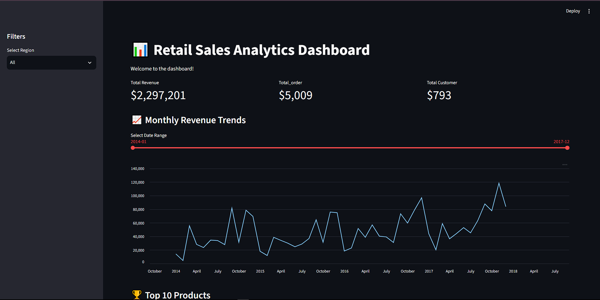
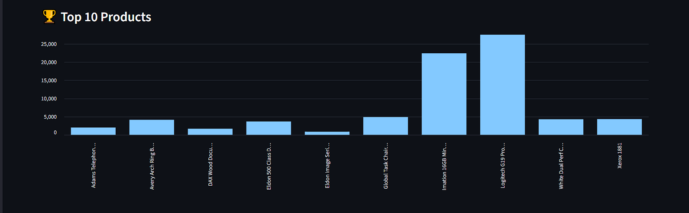
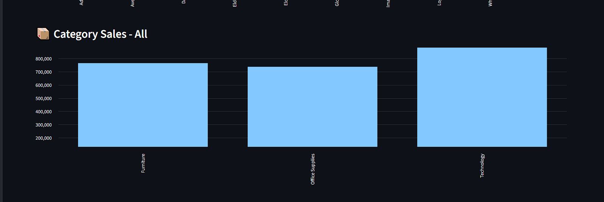
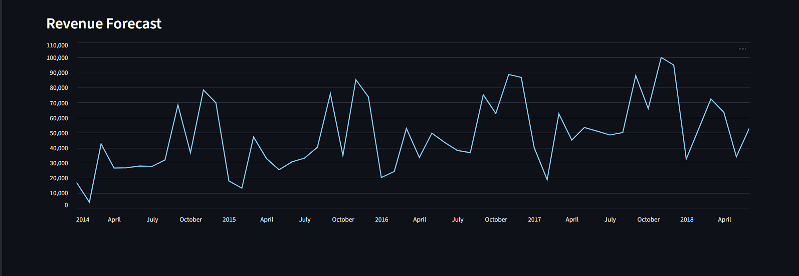

# 📊 Retail Sales Analytics & Forecasting

An end-to-end data pipeline project that transforms raw retail transaction data into actionable business insights — featuring a normalized SQL database, ETL pipeline, SQL-based analytics, exploratory data analysis, time series forecasting, and an interactive dashboard.

## 🎯 Project Overview

This project demonstrates a complete data science workflow:
- **Database Design**: Normalized SQLite schema (customers, products, orders, order_items)
- **ETL Pipeline**: Automated cleaning and loading of raw CSV data into SQL tables
- **SQL Analytics**: Revenue trends, top products, and RFM customer segmentation queries
- **Forecasting**: Prophet-based time series model, benchmarked against a moving average baseline
- **Interactive Dashboard**: Streamlit app with live filters and revenue forecasts

## 🏗️ Architecture
## 📁 Project Structure
```
retail-sales-analytics/
├── data/                  # Raw and processed datasets
├── database/              # DB connection and schema
├── etl/                   # Data cleaning and loading scripts
├── sql_queries/           # Reusable SQL analytics functions
├── notebooks/             # EDA and forecasting notebooks
├── models/                # Saved forecasting model
├── dashboard/             # Streamlit dashboard app
└── requirements.txt
```
## 🔧 Tech Stack

- **Language**: Python
- **Database**: SQLite, SQLAlchemy
- **Data Processing**: Pandas
- **Visualization**: Matplotlib, Seaborn
- **Forecasting**: Facebook Prophet
- **Dashboard**: Streamlit

## 📈 Key Insights

- Sales peak in November-December (holiday season effect)
- Technology category generates the highest revenue
- Prophet forecasting model reduced prediction error by ~60% compared to a moving average baseline

## 🚀 How to Run Locally

```bash
# Clone the repo
git clone https://github.com/irlhasnain/retail-sales-analytics.git
cd retail-sales-analytics

# Create virtual environment
python -m venv venv
source venv/Scripts/activate   # Windows Git Bash
# or venv\Scripts\activate     # Windows PowerShell

# Install dependencies
pip install -r requirements.txt

# Run the ETL pipeline
python -m etl.clean_data
python -m etl.load_data

# Launch the dashboard
streamlit run dashboard/app.py
```

## 📊 Dashboard Preview






## 🔗 Live Demo

*(Deploy hone ke baad link yahan aayega)*

## 📝 License

This project is licensed under the MIT License.
